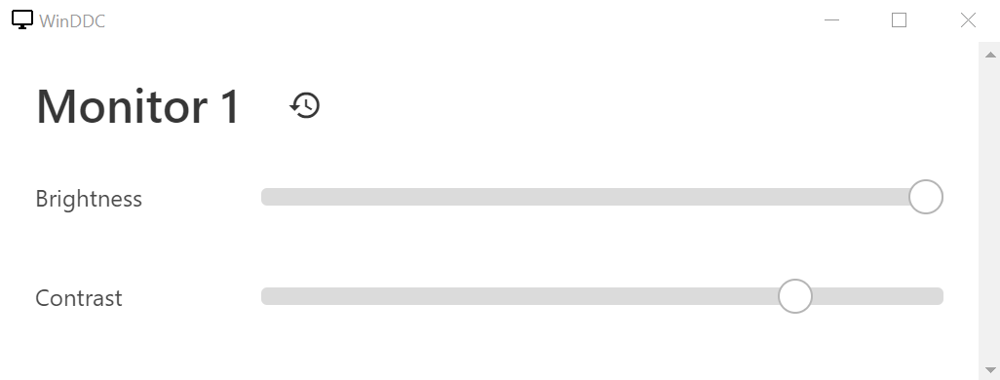

# WinDDC
A simple tray application for Windows to control the brightness of external monitors via DDC/CI. The GUI is built in electron. Currently the window is closed
entirely and only created once the user clicks the systray icon in an attempt to save resources.

## Screenshot


## Building
``` shell
npm run dist
```

## Todo:
- [ ] Add Contrast Controls
- [ ] Add support for multiple monitors
